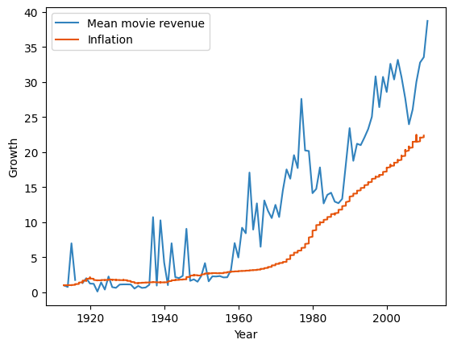

## Abstract

In the dynamic and fiercely competitive realm of the film industry, where artistic brilliance converges with commercial viability, success stands as the ultimate pursuit. "Cinematic Alchemy, Ingredients for Movie Magic" undertakes a comprehensive exploration into the dynamic and highly competitive landscape of the film industry, where the pursuit of success is not merely a goal but a fundamental necessity. Recognizing the industry's relentless quest for acclaim, as evidenced by the numerous prestigious awards, our project aims to identify and analyse the critical elements that provide significant influence over a movie's success.

Through meticulous examination of movie data which could influence both critic and audience ratings, as well as box office revenue, we seek to unravel the elusive formula that transforms a film into a blockbuster. In an era where cinematic achievement is measured not only by artistic brilliance but also by financial prowess, our data-driven analysis positions itself as an indispensable tool for filmmakers, producers, and industry stakeholders.

## Intro
 
Welcome to "Cinematic Alchemy: Ingredients for Movie Magic," a project unraveling the intricate web of factors shaping the success of films. This will be done through rigorous analysis of measures intrinsic to the movie such as its genre, the themes it contains and its duration. Some more external parameters will also be part of the study in particular the timing of its release. More precisely,  a closer look will be taken on the financial context as well as the release month in which the movie has entered the theatres.

Through the scrolling of this website, you will acquire the knowledge that will promote you from a novice movie cooker to a gastronomic producer. 

## Non-correlation scores (Why two metrics?/Success)

Inflation revenue
In order to compare movie revenue across the years, we need to take inflation into account. First, we obtain the inflation data from the CPI python library. Then, we create an inflated revenue column in our dataset, where we adapt the movie box office revenue in today’s value. We can therefore compare 

## Inflation analysis

In order to compare movie revenue across the years, we need to take inflation into account. First, we obtain the inflation data from the CPI python library. We then create an inflated revenue column in our dataset, in which we adjust the box-office revenues of the films to today's values. In the next figure, we show that the mean of movie revenue across the years increases similarly as inflation. We observe a correlation of 0.9 with a p-value smaller than 0.05. 
We will then carry out the remainder of our analysis on data relating to inflated revenues, in order to have similar data from one year to the next.

## Financial analysis

Our next analysis was to compare the financial environment. To define the financial environment, we use the S&P 500 index. The S&P 500 index represents the 500 largest American companies and is one of the most commonly used criteria for determining the state of the economy in general. We obtained some daily values of the index, which enabled us to determine a general context for the economy, using the total return over a certain period. We then determined 5 states of the economy, from very good to very bad, by dividing our returns into 5 equal quantiles. Then, for each film, we were able to assign it an economic context value, from 2 for very good to -2 for very bad. We were then able to regress box-office revenues against this economic context and observe whether there was a general trend towards higher revenues for films released in a good economic context. However, our analysis did not provide us with a p-value > 0.05, so we were unable to reject the null hypothesis that film and economic context are unrelated. Even by trying to change the number of months on which we wanted, or changing the size of the quantiles, we did not get meaningful results. 

## Genre clustering 

## Topic clustering

Another way to get new insight on the success of a film is to look at their topic. For this, we used natural language processing techniques on the plot of movies such as LDA and got 11 topic clusters, each characterised by a lexicon of words. These lexicons are shown in the next graph and the title for these clusters were generated using ChatGPT given the first 20 most important words.

With these wordcloud, we can see that most cluster can be used a thematic of film except “Behind the Scenes of Filmmaking” which shows that some movie plot used  
