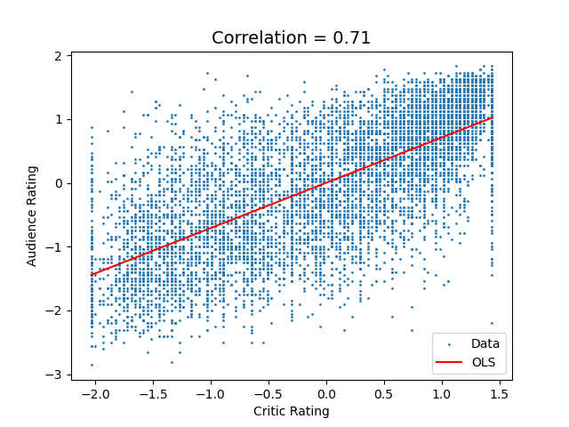
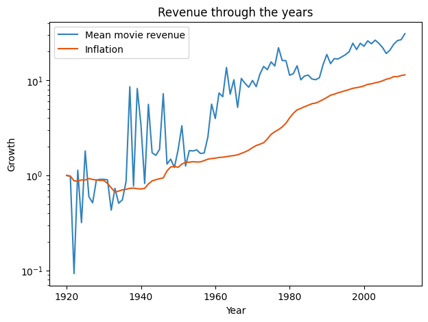
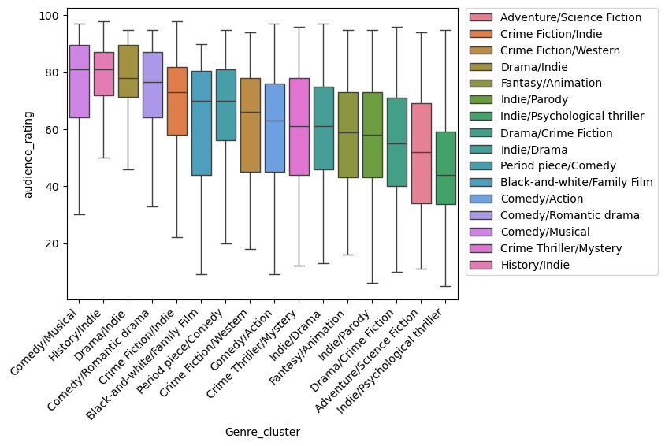
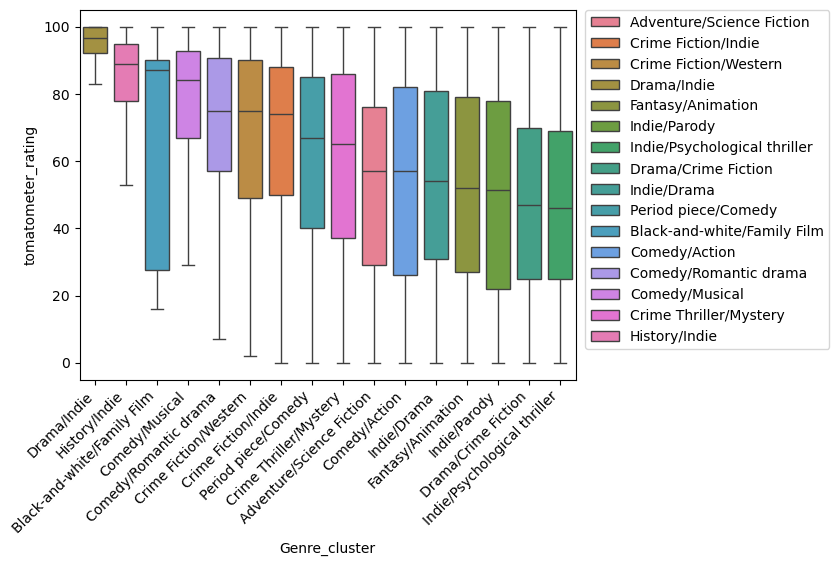
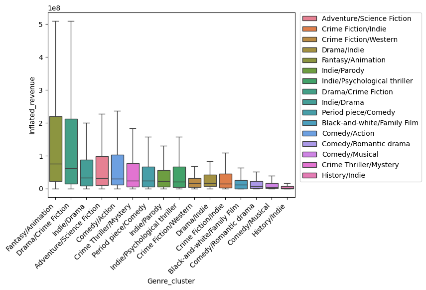
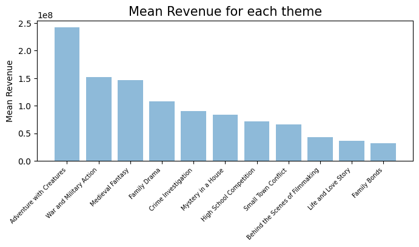

## Abstract

In the dynamic and fiercely competitive realm of the film industry, where artistic brilliance converges with commercial viability, success stands as the ultimate pursuit. "Cinematic Alchemy, Ingredients for Movie Magic" undertakes a comprehensive exploration into the dynamic and highly competitive landscape of the film industry, where the pursuit of success is not merely a goal but a fundamental necessity. Recognizing the industry's relentless quest for acclaim, as evidenced by the numerous prestigious awards, our project aims to identify and analyse the critical elements that provide significant influence over a movie's success.

Through meticulous examination of movie data which could influence both critic and audience ratings, as well as box office revenue, we seek to unravel the elusive formula that transforms a film into a blockbuster. In an era where cinematic achievement is measured not only by artistic brilliance but also by financial prowess, our data-driven analysis positions itself as an indispensable tool for filmmakers, producers, and industry stakeholders.

## Introduction
 
Welcome to "Cinematic Alchemy: Ingredients for Movie Magic," a project unraveling the intricate web of factors shaping the success of films. This will be done through rigorous analysis of measures intrinsic to the movie such as its genre, the themes it contains and its duration. Some more external parameters will also be part of the study in particular the timing of its release. More precisely,  a closer look will be taken on the financial context as well as the release month in which the movie has entered the theatres.

Concretely, we want to test the different relationships between the variables. The following causal diagrams illustrate the different links that will be investigated along the data story. For each variable, we defined the type of success it could affect. Our success was defined in three ways: the audience rating, which is the rating given by normal people like you and me. We also use the critics' rating. Both of these ratings are obtained through the Rotten Tomatoes database. Another measure of success that we wanted to study is box-office revenue. For the internal elements likely to affect the success of a film, we used the length of the film, the genre, which is the overall type of film, and the subject, which are the themes present in the film.
Using the topics allows us to have a more fine-grained classification of movies for constructing our paired matchings. Moreover, while the genres are clustered, we are able to obtain non-disjoint topic labels which more accurately reflect the structure of the dataset. Finally, we want to assess whether the actors have an impact on the film's revenue.

To compile the necessary data, we integrated information from three datasets. The initial dataset is sourced from the [CMU Movie Summary Corpus](https://www.cs.cmu.edu/~ark/personas/), providing details on films for analysis including their plot, actors, and certain box office revenue figures. To increase the number of films with available box office data, we incorporated [The Movies Dataset](https://www.kaggle.com/datasets/rounakbanik/the-movies-dataset/), which includes information on film budgets and revenues. Additionally, we conducted web scraping on the [Rotten Tomatoes website](https://www.rottentomatoes.com/) to recover the critics. You can also find these link later in the resources tab in the navigation bar.

## Correlation between success types

One might wonder if it is really necessary to consider both metrics for success. It is a fair question to be asked since one could think that they reflect the same phenomenon. But before solving such a mystery, one needs to think about which rating would make sense. There are two main types: The critic score and the audience rating. Should we consider both?

By standardising the data, one can read the correlation coefficients between the success metrics on the plot which is given by the slope of the line given by the OLS.
 
Where the ratings are quite well correlated, the audience score doesn’t seem to have any link with the box office revenue. Therefore, we will keep track of the audience rating and of the financial metric.

## Inflation analysis

In order to compare movie revenue across the years, we need to take inflation into account. First, we obtain the inflation data from the CPI python library. We then create an inflated revenue column in our dataset, in which we adjust the box-office revenues of the films to today's values. In the next figure, we show that the mean of movie revenue across the years increases similarly as inflation. We observe a correlation of 0.9 with a p-value smaller than 0.05.
We can see some interesting facts in this figure. Firstly, the average box office revenue for movies prior to 1950 are quite noisy. There are two reasons for this: firstly, we have a smaller number of films for these periods and, as a result, a film with very high revenues will have a considerable impact on the average for the current year. Secondly, some films from these years (such as Disney hits Bambi or Snow White) have been remade over the years, but their box office takings have been counted in the original version. After these noisy parts, we see a clear increase around 1960, while there is no particular increase in the measure of inflation. This period of high incomes lasted until around 1980, when we see a slight decline, combined with a period of high inflation.  This implies the end of this golden age of cinema. Thereafter, we see what appears to be a fairly similar increase between average film revenues and inflation.

## Financial analysis 

Our next analysis was to compare the financial environment. To define the financial environment, we use the S&P 500 index. The S&P 500 index represents the 500 largest American companies and is one of the most commonly used criteria for determining the state of the economy in general. We obtained some daily values of the index, which enabled us to determine a general context for the economy, using the total return over a certain period. We then determined 5 states of the economy, from very good to very bad, by dividing our returns into 5 equal quantiles. Then, for each film, we were able to assign it an economic context value, from 2 for very good to -2 for very bad. We were then able to regress box-office revenues against this economic context and observe whether there was a general trend towards higher revenues for films released in a good economic context. However, our analysis did not provide us with a p-value > 0.05, so we were unable to reject the null hypothesis that film and economic context are unrelated. 
Even when we tried to change the number of months over which we calculated returns, or by changing the size of the quantiles, we did not obtain significant results. We can therefore assume that films are a good sector for protecting against crises. However, a more detailed analysis should be carried out to confirm this hypothesis.

## Genre clustering 

As we want to compare our various success metrics across genres, we need a way to cluster the movies by their assigned set of genres.
Indeed, the set of genres for each movie will partition the dataset in subsets that are too small for any statistically significant analysis.

Hence, we explore various approaches for clustering our movies along genres.
A natural approach is to use the Jaccard distance, as each of our movies have an entire set of genres instead of a single genre assigned to them.
However, K-means clustering implementations usually do not support smart centroid initialization techniques such as KMeans++ for the Jaccard distance, and coming up with one is out of the scope of this project.
Moreover, sticking with the Euclidean metric leads to much quicker execution times.

Using silhouette analysis, we obtain an optimum of K = 16.
We obtain the following clusters:

1. History, Indie, Biography, Short Film, Documentary
1. Comedy, Adventure, Action/Adventure, Action, Drama
1. Comedy, Indie, Black-and-white, Short Film, Silent film
1. Indie, Crime Fiction, Comedy, World cinema, Drama
1. Drama, Comedy, Black-and-white, Romance Film, Short Film
1. Romance Film, Drama, Musical, World cinema, Bollywood
1. Family Film, Drama, Musical, Romance Film, Comedy
1. World cinema, Comedy, Romantic drama, Romance Film, Drama
1. Short Film, Indie, Drama, Silent film, Black-and-white
1. Family Film, Romance Film, Comedy film, Short Film, Animation
1. Indie, Family Film, Comedy, Romance Film, Romantic comedy
1. Drama, Crime Fiction, Action/Adventure, Thriller, Action
1. Crime Thriller, Mystery, Crime Fiction, Drama, Thriller
1. Indie, Thriller, World cinema, Science Fiction, Horror
1. Animation, Fantasy, Family Film, Adventure, Drama
1. War film, Romance Film, Crime Fiction, Drama, Black-and-white

After we obtain clusters, we analyse the differences in each of our success metrics between clusters.

As expected, musical comedies score high in the audience rating, while artsy and older movies (black and white, history and indie movies) score higher in the critic rating. Regarding the revenue, the highest grossing genres are fantasy and crimegi fiction, which include genre-defining movies such as Snow white, which is the highest grossing movie of all time, as well as blockbusters such as Avatar.

After fitting a linear regression model for each metric, using the genre cluster as a categorical predictor, we observe that while the genre isn't a good predictor for the revenue (reaching an R²-value of 0.052), it seems to be influencing both the audience and critics rating, with R²-values of 0.132 and 0.111, respectively. However, further analysis is needed to conclude the existence of a causal relationship.

## Topic clustering

Another way to get new insight on the success of a film is to look at their topic. For this, we used natural language processing techniques on the plot of movies such as LDA and got 11 topic clusters, each characterised by a lexicon of words. These lexicons are shown in the next graph and the title for these clusters were generated using ChatGPT given the first 20 most important words.

With these wordcloud, we can see that most cluster can be used a thematic of film except “Behind the Scenes of Filmmaking” which shows that some movie plot used  

Through the analysis of these word clouds, it becomes evident that the majority of lexicon align thematically with films. This is good news! However, a notable exception is found in the "Behind the Scenes of Filmmaking" lexicon, indicating that certain movie plots incorporate this vocabulary into their storyline, while others do not.
Leveraging these lexicons, we can categorize films based on their themes, considering that a single film may fall into several thematic categories. This is quite interesting as we can gain new alchemy insight on one film success given its theme.

We'll explore the popularity of themes over the years. It's evident that war and military films held significant appeal from 1940 to 1970. This is probably related to propaganda film during WW2 and the Cold War. Simultaneously, family dramas emerged as a prolific thematic genre, with a notable increase in film production in the 70s.

What is even more important is to look at the revenue of film per topic. This is really interesting! While some patterns can be seen in the next graph, we ran a regression using all topics to see their impact on the revenue and the results are exciting! With P-values of zero, we have that Adventure with Creatures, War and Action and Medieval Fantasy are the most profitable topics. While Life and Love Story and Family Bonds are definitely not the best topics to choose if you want to make money.

## Impact of Movie Length On Inflated Revenue
As seen in our causal diagrams, we suspect that movie lengths influence the inflated revenue differently depending on the movie genre. We first compared movie lengths by categorising them as Short, Medium, Long and Very Long. Then we performed a 1-to-1 matching to get an equal quantity of same genre movies for very long and not very long movies. We do so such that a positive and negative influence on inflated revenue for 2 different movie genres don't cancel each other out: we want to observe both!🙂

## Impact of Release Month On Inflated Revenue
We suspect that the coreleasing a movie in or outside of holiday seasons influence the inflated revenue differently depending on the movie genre. We first compared movie lengths by categorising them as Short, Medium, Long and Very Long. Then we performed a 1-to-1 matching to get an equal quantity of same genre movies for very long and not very long movies. 

## Conclusion
